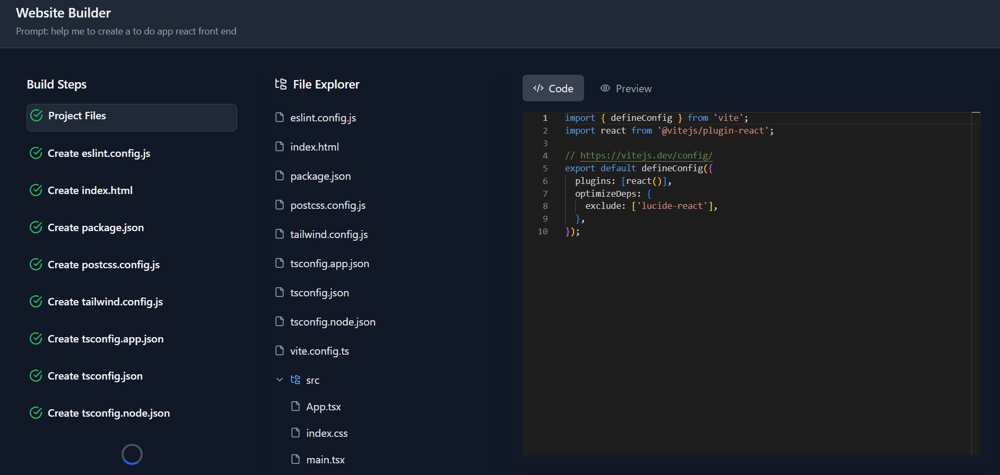

# Bolt The Website Creator
## Overview:
Bolt The Website Creator is an AI-powered web application that can generate code for websites using React or Node.js, based on user prompts. It was inspired by the popular Bolt.new platform.


## Key Features:
- #### AI-Powered Website Generation:
  *  Bolt leverages a powerful language model, LLaMA3-GROQ-8B-8192, and GROQ API to generate custom website code based on user prompts.
  * The LLaMA3-GROQ-8B-8192 model is a large language model based on the LLaMA architecture, fine-tuned on the GROQ query language. This model provides Bolt with the ability to understand and generate GROQ code, which is used to query and manipulate data in the Bolt application.
  * The GPT wrapper allows Bolt to utilize the capabilities of large language models like LLaMA3-GROQ-8B-8192 to generate and refine the website code based on user prompts.
  * [GORQ]([https://www.example.com](https://groq.com/))

 - React and Node.js Support: The application can create websites using either React or Node.js, allowing users to choose their preferred technology stack.
 - Web-Based Preview: Bolt includes a web container that allows users to preview the generated website directly within the application. The web container is a self-contained environment that runs the generated website code, providing a seamless user experience.
 - Intuitive User Interface: The application features a clean and user-friendly interface, making it easy for users to describe their desired website and generate the corresponding code.

## Project Structure:
- Backend: The project includes a backend directory, which likely contains the server-side code, API endpoints, and other server-related functionality.[be](be)
- Frontend: The frontend directory contains the client-side code, including React components, styles, and other user interface-related files.[frontend](frontend)

## Getting Started:
- Clone the repository:
  ```javascript
  https://github.com/sakshamagarwalm2/Bolt.git

